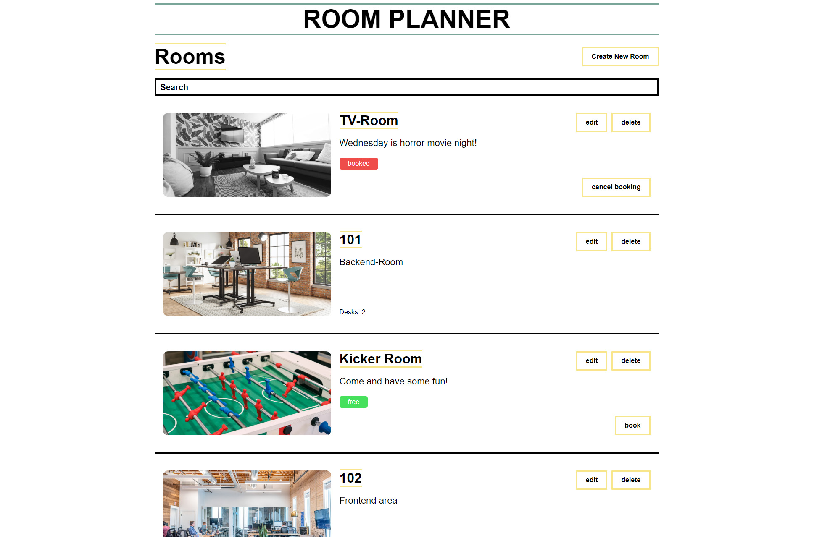

# full-stack-challenge

Welcome to our full-stack challenge! The idea of this challenge is to start building the front- and backend for a tool a shared office can use to manage their rooms and desks. No worries, you don't need to build everything, just the first two features!

This office has got many rooms. If you plan to go to the office, you can book a table in a room or a whole room. An office building consists of two types of rooms:

- A room with bookable desks inside, like a typical working room
- A room without work desks, like a TV room or a conference room

You can never book a room if it has bookable desks inside, only the desks inside the room are bookable. On the other hand, a room without desks can be booked.

Your job is to start with the development of the first two features: The list of rooms and booking a room. This means as well, that creating/editing tables and rooms, booking tables and a room detail view is out of scope for this challenge.

## Before we get started:

- Take as much time as you need to finish the excercise
- If anything is unclear, don't hesitate to ask the person who has sent you the challenge for help
- Try to follow the tasks and implement the design as closely as possible
- Write your code and use best practices as you would do in an enterprise context
- Create a branch for your solution and make a PR containing everything you have done when you finished the challenge
- Put reasonable information inside the PRs description
- Extend this readme with information on how to run your application

## Technologies you should use:

If you can't use anything inside this section, just leave it out and substitute with another technology. No need to learn new stuff inside this challenge!

- TypeScript
- Nest.js
- Next.js
- Apollo Client and Server
- Any DB or just local state inside the backend

# Tasks

The requirements are written from a frontend perspective. Create your back- and frontend based upon these requirements. Make smart, yet pragmatic decisions on what logic and state to store inside the backend and what to just keep inside the frontend.

In this view, the users can see a filterable list of rooms as well as a button to create a room. Inside the room elements, users can book rooms which have no desks and edit or delete rooms.

## Header

- Create a headline for the whole app ("Room Planner")
- Create a smaller Headline for the room list page ("Rooms")
- Add an input for filtering the room list by name of the room

## Room List

- Create a room element which can be used inside the list
- Add the room's image, which is greyed out if the room is booked
- Add a hover effect for the whole list element in a color of your choice
- Add the room's name, description and booking status
- If the room has desks, put the number below the description
- Add an edit and delete button
- If the edit button is clicked, nothing should happen for now
- If the delete button is clicked, the room should be deleted
- If the room has no desks, put a "book" button below the two buttons
- If the book button is clicked, the room should be booked and the button should change its title to "unbook"
- If the "unbook" button is clicked, the room should be unbooked and the button should change its title back to "book"

## That's it!

Have fun, and don't forget to send us the link to your solution's repo when you are done!
